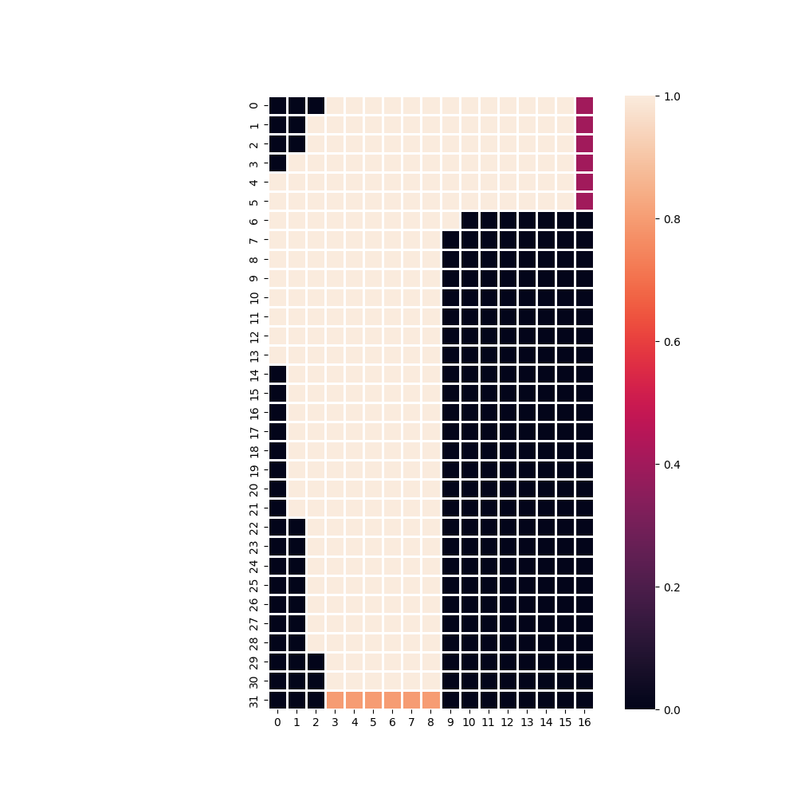
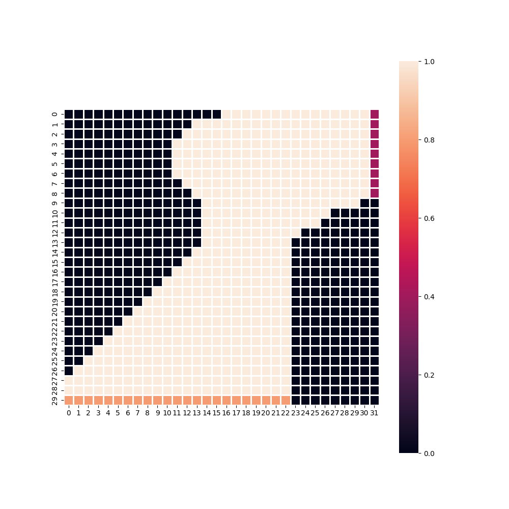

# Programming Assignment #2

Please follow the instructions below to run the code:

1. Clone the repository to the local computer: (https://github.com/ShivprasadGS/Tufts_RL/tree/main/HW02)
2. Open the project in the editor (e.g. Pycharm)
3. Run the following command in the local terminal: "pip install -r requirements.txt"
4. This will install all the necessary libraries and dependencies for this program.
5. Run "design_racetrack.py" to create the racetrack designs as follows:
    
6. In "main.py":
   1. If you want to train the model: On line 155, make sure "train = True"
   2. If you want to visualize the model performance: On line 155, make sure "train = False"
7. Run "main.py"